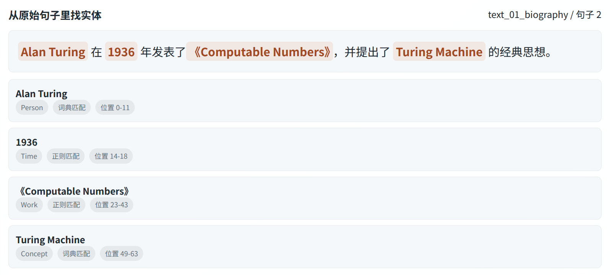
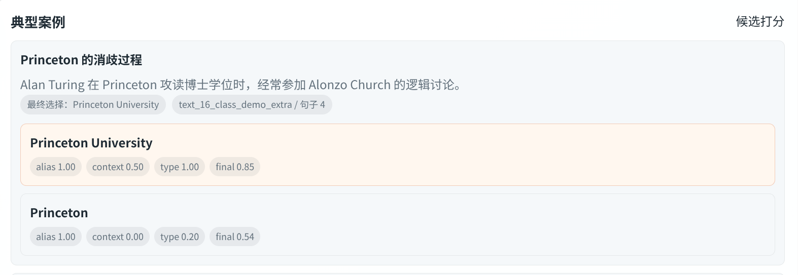
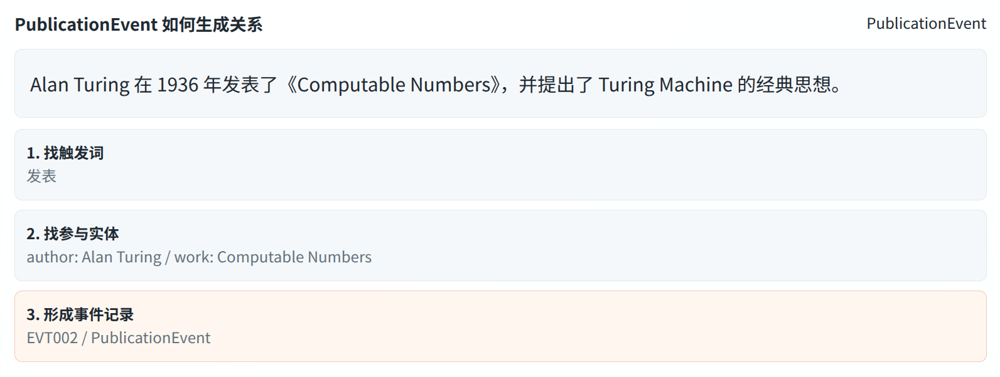
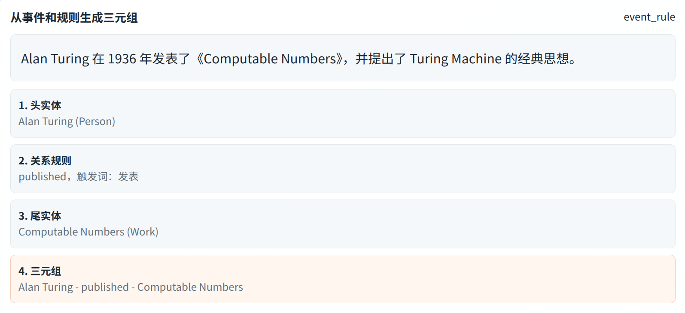
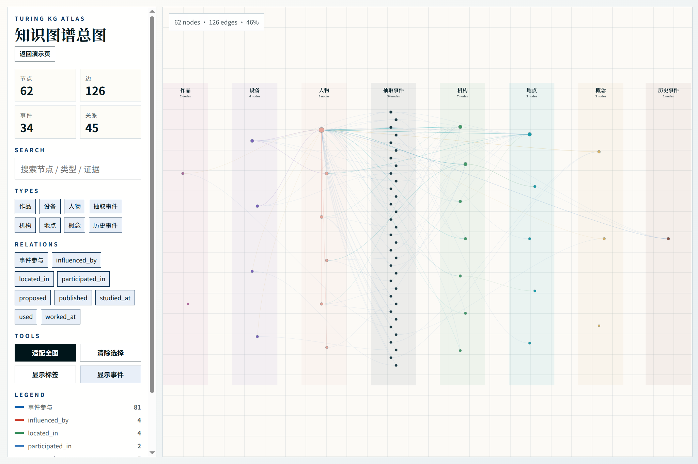

# 图灵知识图谱构建实验报告

## 一、实验目标与方法原则

本实验围绕 Alan Turing 构建一个多主体知识图谱。

我的原则是不依赖预训练模型以及大模型的能力，用纯粹的传统 NLP 手段实现这个知识图谱 demo。

最终构建的知识图谱除了 Turing 本人以外，还加入了 Joan Clarke、Alonzo Church、Max Newman、John von Neumann 等相关人物，以及 Bletchley Park、Princeton University、University of Manchester、Bombe、Manchester Mark I 等机构和设备。

## 二、数据来源与预处理

原始数据放在 `data/raw/`，共有 16 份短文本，来源信息记录在 `data/raw/source_manifest.json`。这些文本主要根据公开资料整理，少量由我自己为了演示方便而编写，来源包括 The Turing Digital Archive、Bletchley Park、Princeton University、University of Manchester 等。

数据整理时，我没有直接复制网页全文，而是直接整理成了适合规则抽取的短句。主要是纯粹的规则法对句子表达比较敏感，短句更方便观察规则是否漏抽，效果也更好。对于一些代词较多的句子，我会改成显式主语，因为本项目没有实现共指消解，必须在数据准备阶段把这件事情做好。

## 三、实体抽取流程

实体抽取的任务是从分句后的 raw 文本中识别实体 mention，我采用了两类规则：

1. 对人物、机构、地点、设备、概念、作品等实体，使用 `data/kb/seed_entities.json` 中的种子词典以及它们对应的别名进行匹配。
2. 对时间等格式比较明显的内容，使用正则表达式匹配。

例如，句子中出现 Princeton University 时，它会被词典识别为 Organization；出现 1936 这类年份时，会被正则识别为 Time。这样设计的优点是结果稳定、解释简单，可以直接说明“这个实体被抽取是因为命中了哪个词典别名或哪个正则规则”。缺点也很明确，词典之外的新实体不会自动识别，需要后续人工补充。

效果如图：



## 四、实体消歧流程

实体抽取只解决“句子里出现了什么词”，还没有解决“这个词到底代表哪个实体”。例如 `Cambridge` 可能指 `Cambridge` 这座城市，也可能指 `University of Cambridge` 这个机构。

我的消歧方法是给候选实体做简单打分。分数主要由三部分组成：

1. alias_score：mention 和候选实体名称、别名是否相近。
2. `context_keyword_score`：句子上下文是否命中候选实体的关键词。
3. `type_prior_score`：抽取阶段判断的实体类型是否和候选实体类型一致。

最后按照加权分数选择最高的候选实体。如果上下文中出现“学习、学院、数学”等词，`Cambridge` 更可能被连到 `University of Cambridge`；而如果上下文强调“城市、英格兰东部”，则更可能连到 `Cambridge` 这个地点。

效果如图：由于 `Princeton University` 命中了“博士”这个关键词，所以 context 得分为 0.5



## 五、事件抽取流程

事件抽取主要依赖“触发词 + 参与实体类型”的规则。根据图灵主题，我设置了几类最常见、也最容易解释的事件：

- `EducationEvent`：学习、就读、接受教育等句子。
- `PublicationEvent`：发表论文或作品的句子。
- `ResearchEvent`：提出概念、研究机器、讨论测试等句子。
- `WarWorkEvent`：Bletchley Park、Enigma、Bombe 等战争密码工作相关句子。
- `EmploymentEvent`：在某机构工作、任职或参与项目的句子。
- `InfluenceEvent`：人物之间影响或启发关系的句子。

例如，原句“Alan Turing 在 1936 年发表 Computable Numbers，并提出 Turing Machine 概念”会被识别出 `PublicationEvent` 和 `ResearchEvent`。这样做的好处是，后面每一条关系都可以先回到一个事件，再回到原始文本。

效果如图：



## 六、关系抽取流程

关系抽取负责把事件和部分明显句式转换为三元组。本阶段可以概括为：

- 输入：已消歧实体和事件记录。
- 方法：事件类型到关系类型的规则映射，并补充少量句式规则。
- 输出：关系三元组。

核心思路是先判断事件类型，再根据参与实体角色生成三元组。例如：

```text
PublicationEvent
  -> author: Alan Turing
  -> work: Computable Numbers
  -> Alan Turing - published - Computable Numbers
```

目前保留的关系类型包括 `studied_at`、`worked_at`、`published`、`proposed`、`influenced_by`、`participated_in`、`used`、`located_in`。这些关系数量不算多，但能够覆盖本项目的主要知识：学习经历、研究成果、人物影响、战争密码工作、设备使用和机构地点。

效果如图：



## 七、知识图谱建立方式

前几步执行完毕后，构建知识图谱就很简单了，`graph.json` 中的节点来自成功链接的实体，边来自关系抽取结果。可视化结果：http://182.92.128.113:8000/web/kg-atlas.html



## 八、实验总结

通过这次实验，我更清楚地理解了知识图谱不是只画一张关系图，而是由数据来源、实体识别、实体链接、事件组织、关系生成共同组成的一套算法体系。

最后附上项目的各类结果文件供查看：


```text
data/raw/*.txt
  -> 预处理与分句
  -> data/intermediate/mentions.jsonl        # 实体识别
  -> data/intermediate/linked_entities.jsonl # 实体消歧
  -> data/output/events.json                 # 事件抽取
  -> data/output/relations.csv               # 关系抽取
  -> data/output/entities.json               # 最终的实体抽取结果
  -> data/output/graph.json                  # 构建的知识图谱
```

